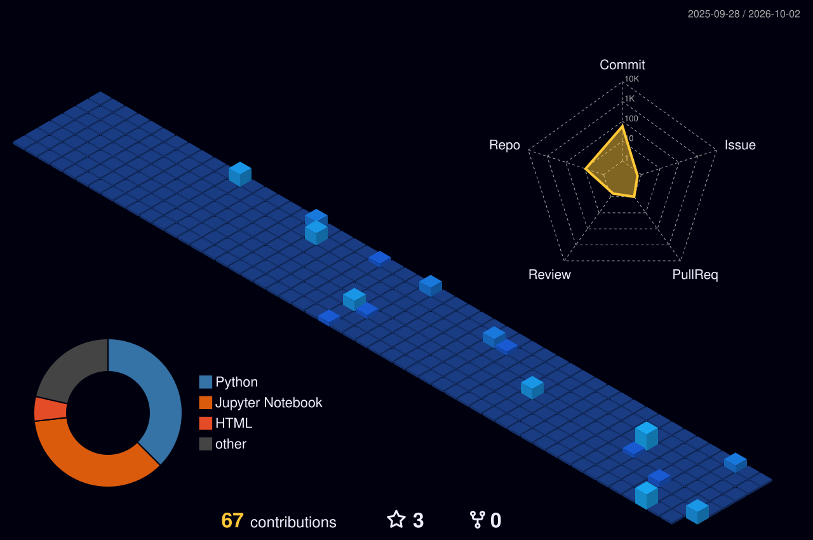

## Projects

| Project | What it does |
|---|---|
| [Mental-Health-Score-Predictor_MLops](https://github.com/sanjaygill-ai-ml/Mental-Health-Score-Predictor_MLops) | Random Forest model (R² ≈ 0.88) served via FastAPI with a custom frontend |
| [AutoML-MLOps-Platform](https://github.com/sanjaygill-ai-ml/-AutoML-MLOps-Platform) | Automates the ML lifecycle: ingestion, deployment, monitoring, retraining |
| [DeepResearch-AI-Agents](https://github.com/sanjaygill-ai-ml/DeepResearch-AI-Agents) | Multi-agent research system with RAG |
| [SnapShort-AI-Attendance-APP-](https://github.com/sanjaygill-ai-ml/SnapShort-AI-Attendance-APP-) | AI-based attendance app |

